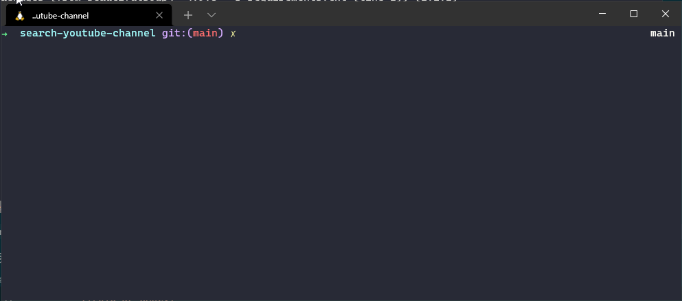
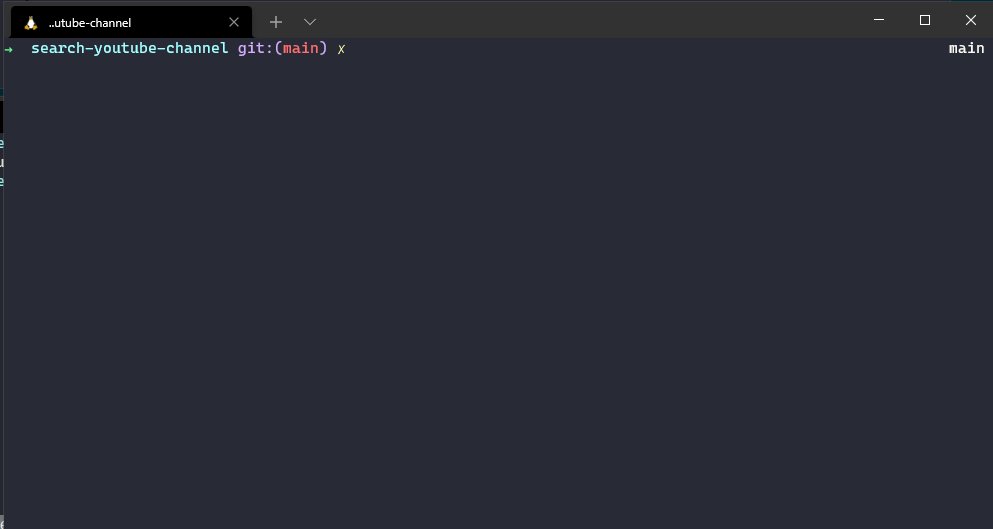
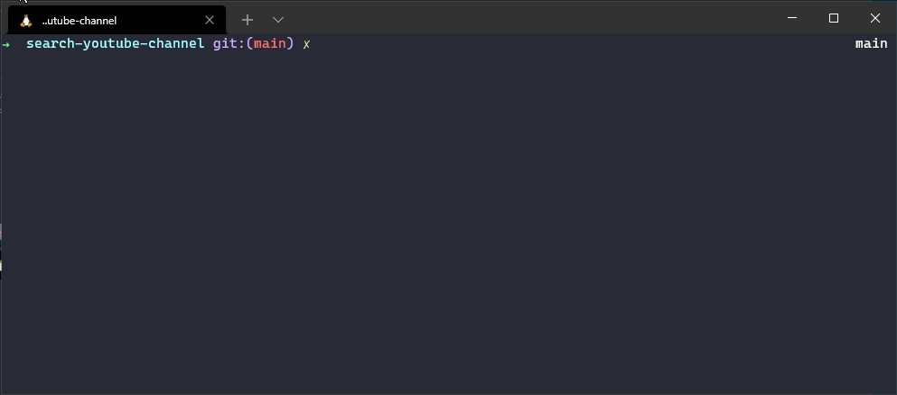

# Search Youtube Channel
Este sistema pesquisa por canais no [youtube](https://www.youtube.com/) e coleta as seguintes informações:
- ID do canal
- Nome do canal
- Descrição do Canal
- Url do canal
- Imagem do perfil no formato base64
- Texto de pesquisa

## Instalação
> Requerimentos

- Antes de executar o projeto instale os pré-requisitos
1. [python@3.8.10](https://www.python.org/downloads/)
2. [pip@20.0.2](https://docs.python.org/3/installing/index.html#pip-not-installed)

> Iniciando o ambiente

- Na raiz do projeto execute
  ```zsh
  pip install -r requirements.txt
  ````
	

## Execução
> Executando um busca
- Na raiz do projeto execute
	```zsh
	python main.py 'TEXTO_DE_BUSCA'
	```
	
	
	
	
