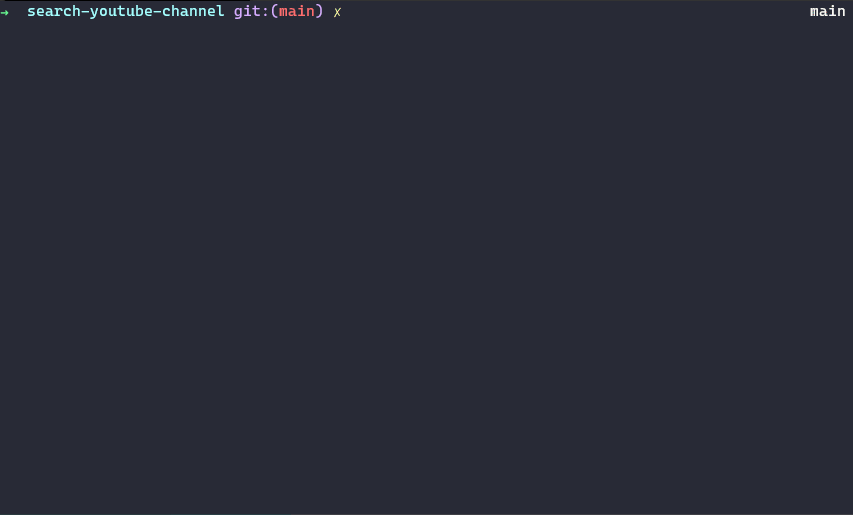

# Search Youtube Channel



Este sistema pesquisa por canais no [youtube](https://www.youtube.com/) e coleta as seguintes informações:
- ID do canal
- Nome do canal
- Descrição do Canal
- Url do canal
- Imagem do perfil no formato base64
- Texto de pesquisa

## Instalação

- [python@3](https://www.python.org/downloads/)
- [pip](https://docs.python.org/3/installing/index.html#pip-not-installed)


- Na raiz do projeto execute
```zsh
pip install -r requirements.txt
```
## Execução
- Na raiz do projeto execute
```zsh
python main.py 'TEXTO_DE_BUSCA'
```
